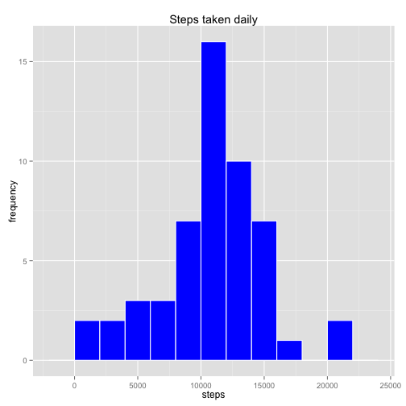
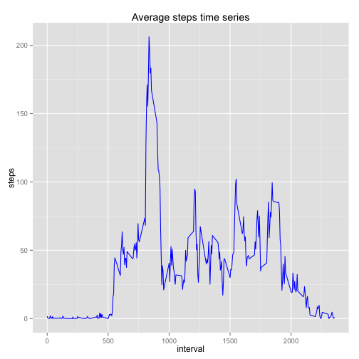
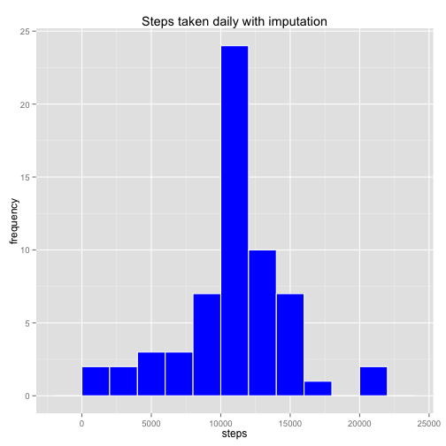
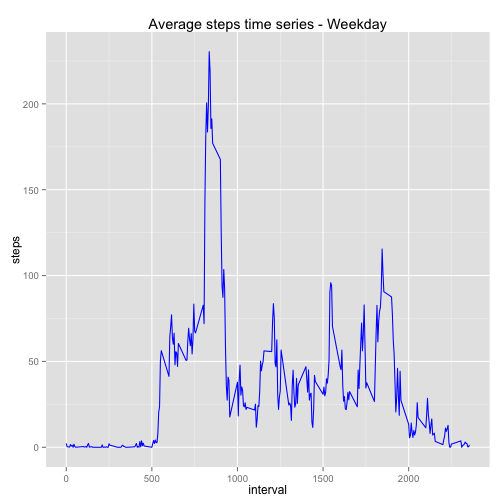
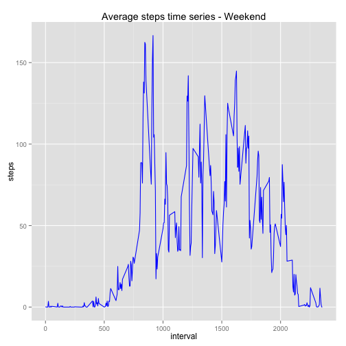

Some basic housekeeping
=======================

This document is part of the first peer assessment for the Reproducible Research course on Coursera, conducted by Johns Hopkins University. Detailed information on the requirements of this exercise can be found [here in this Github repository](https://github.com/rdpeng/RepData_PeerAssessment1). I'll be setting echo=TRUE to enable the code to be read.


```r
echo=TRUE
```

Step 1: Read in the data
========================

I have already downloaded the data (a zipped file) and unzipped it to my working directory. The next step is to read it in as a .csv file


```r
set1 <- read.csv('activity.csv')
```

Step 2: Basic processing
========================


```r
str(set1)
```

```
## 'data.frame':	17568 obs. of  3 variables:
##  $ steps   : int  NA NA NA NA NA NA NA NA NA NA ...
##  $ date    : Factor w/ 61 levels "2012-10-01","2012-10-02",..: 1 1 1 1 1 1 1 1 1 1 ...
##  $ interval: int  0 5 10 15 20 25 30 35 40 45 ...
```

The data has 3 variables: *steps*, *date* and *interval*. Of these, the *date* variable is a factor, and can be handled better if changed to a date. 


```r
set1$date <- as.Date(set1$date, format = "%Y-%m-%d")

str(set1)
```

```
## 'data.frame':	17568 obs. of  3 variables:
##  $ steps   : int  NA NA NA NA NA NA NA NA NA NA ...
##  $ date    : Date, format: "2012-10-01" "2012-10-01" ...
##  $ interval: int  0 5 10 15 20 25 30 35 40 45 ...
```

Step 3: What is mean total number of steps taken per day?
=========================================================

We have been instructed to ignore missing values. We will work on a dataset omitting NA cases for steps.

Calculating the total number of steps taken per day using the aggregate function.


```r
set2 <- na.omit(set1)
steps_tot <- aggregate(set2$steps,by=list(set2$date), FUN=sum, na.rm=TRUE)
colnames(steps_tot) <- c("date", "steps")
str(steps_tot)
```

```
## 'data.frame':	53 obs. of  2 variables:
##  $ date : Date, format: "2012-10-02" "2012-10-03" ...
##  $ steps: int  126 11352 12116 13294 15420 11015 12811 9900 10304 17382 ...
```

We will use ggplot to make a histogram of the number of steps in a day. Bins chosen to create around 10 bins.


```r
library(ggplot2)
ggplot(steps_tot, aes(x = steps)) + 
        geom_histogram(fill = "blue", colour = "white", binwidth = 2000) + 
                labs(title = "Steps taken daily", x = "steps", y = "frequency") 
```

 

We also calculate the median and mean number of steps per day below.


```r
median(steps_tot$steps)
```

```
## [1] 10765
```

```r
mean(steps_tot$steps)
```

```
## [1] 10766.19
```

Step 4: What is the average daily activity pattern?
===================================================

We are interested to look at the time-series trend of the average number of steps in each interval, averaged across all days.

For this, we again use the aggregate function. 


```r
steps_avg <- aggregate(set2$steps,by=list(set2$interval), FUN=mean, na.rm=TRUE)
colnames(steps_avg) <- c("interval", "average_steps")

str(steps_avg)
```

```
## 'data.frame':	288 obs. of  2 variables:
##  $ interval     : int  0 5 10 15 20 25 30 35 40 45 ...
##  $ average_steps: num  1.717 0.3396 0.1321 0.1509 0.0755 ...
```

To visualize this as a time series we use ggplot again.


```r
ggplot(steps_avg, aes(interval, average_steps)) + 
        geom_line(color = "blue") + 
                labs(title = "Average steps time series", x = "interval", y = "steps")
```

 

We identify the interval number where the maximum average number of steps occurs, below.


```r
steps_avg[which.max(steps_avg$average_steps),]
```

```
##     interval average_steps
## 104      835      206.1698
```

Step 5: Imputing missing values
===============================

Calculate and report the total number of missing values in the dataset (i.e. the total number of rows with NAs)


```r
sum(is.na(set1$steps))
```

```
## [1] 2304
```

Devise a strategy for filling in all of the missing values in the dataset. Create a new dataset that is equal to the original dataset but with the missing data filled in.

A simple imputation strategy can be to substitute with the average value for the interval. I am creating a new dataset below, having the missing values imputed as described.


```r
set3 <- set1

for (i in 1:nrow(set3)) {
        if (is.na(set3$steps[i])) {
                set3$steps[i] <- 
                steps_avg[which(set3$interval[i] == steps_avg$interval), ]$average_steps
                                }
}

sum(is.na(set3$steps))
```

```
## [1] 0
```

Make a histogram of the total number of steps taken each day. Steps are similar to earlier.


```r
steps_tot1 <- aggregate(set3$steps,by=list(set3$date), FUN=sum, na.rm=TRUE)
colnames(steps_tot1) <- c("date", "steps")
str(steps_tot1)
```

```
## 'data.frame':	61 obs. of  2 variables:
##  $ date : Date, format: "2012-10-01" "2012-10-02" ...
##  $ steps: num  10766 126 11352 12116 13294 ...
```

```r
ggplot(steps_tot1, aes(x = steps)) + 
        geom_histogram(fill = "blue", colour = "white", binwidth = 2000) + 
                labs(title = "Steps taken daily with imputation", x = "steps", y = "frequency") 
```

 

We calculate the median and mean for this new imputed dataset.


```r
median(steps_tot1$steps)
```

```
## [1] 10766.19
```

```r
mean(steps_tot1$steps)
```

```
## [1] 10766.19
```

These values are different, with the median now equal to the mean. The number of total steps has increased over the unimputed dataset. Comparisons are below:


```r
new_median <- median(steps_tot1$steps)
new_mean <- mean(steps_tot1$steps)
new_tot <- sum(steps_tot1$steps)

old_median <- median(steps_tot$steps)
old_mean <- mean(steps_tot$steps)
old_tot <- sum(steps_tot$steps)

difference_median <- new_median - old_median
difference_mean <- new_mean - old_mean
difference_sum <- new_tot - old_tot

difference_median
```

```
## [1] 1.188679
```

```r
difference_mean
```

```
## [1] 0
```

```r
difference_sum
```

```
## [1] 86129.51
```

Step 6: Are there differences in activity patterns between weekdays and weekends?
=================================================================================

We create a factor variable to separate weekdays and weekends, on the new dataset with imputed values.


```r
set3$daywk <- weekdays(set3$date)
weekdays1 <- c('Monday','Tuesday','Wednesday','Thursday','Friday')
set3$wkday <- factor((weekdays(set3$date) %in% weekdays1), levels=c(FALSE,TRUE), 
                        labels=c('weekend', 'weekday'))
str(set3)
```

```
## 'data.frame':	17568 obs. of  5 variables:
##  $ steps   : num  1.717 0.3396 0.1321 0.1509 0.0755 ...
##  $ date    : Date, format: "2012-10-01" "2012-10-01" ...
##  $ interval: int  0 5 10 15 20 25 30 35 40 45 ...
##  $ daywk   : chr  "Monday" "Monday" "Monday" "Monday" ...
##  $ wkday   : Factor w/ 2 levels "weekend","weekday": 2 2 2 2 2 2 2 2 2 2 ...
```

```r
set3_wkdy <- set3[set3$wkday=='weekday',]
set3_wknd <- set3[set3$wkday=='weekend',]

steps_avg_wkdy <- aggregate(set3_wkdy$steps,by=list(set3_wkdy$interval), FUN=mean, na.rm=TRUE)
colnames(steps_avg_wkdy) <- c("interval", "average_steps")

steps_avg_wknd <- aggregate(set3_wknd$steps,by=list(set3_wknd$interval), FUN=mean, na.rm=TRUE)
colnames(steps_avg_wknd) <- c("interval", "average_steps")
```

Finally, we do two time series plots to compare weekday vs. weekend activity.


```r
par(mfrow=c(2,1))

ggplot(steps_avg_wkdy, aes(interval, average_steps)) + 
        geom_line(color = "blue") + 
                labs(title = "Average steps time series - Weekday", x = "interval", y = "steps")
```

 

```r
ggplot(steps_avg_wknd, aes(interval, average_steps)) + 
        geom_line(color = "blue") + 
                labs(title = "Average steps time series - Weekend", x = "interval", y = "steps")
```

 

There appears to be more sustained activity during later time intervals on weekends.
